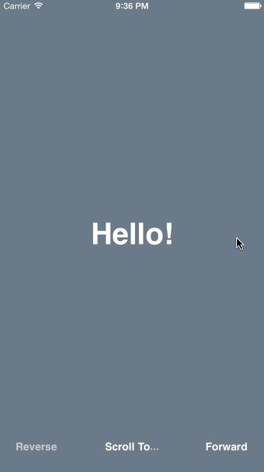

# EMPageViewController



## A better page view controller for iOS
EMPageViewController is a full replacement for UIPageViewController with the features and predictability you’ve always wanted from a page view controller.

### Delegate messages every step of the way
EMPageViewController gives your delegate messages for every step of the page transition process: before, during, and after. This makes it very easy for you to incorporate animations or any other events that are highly dependent on the progress of transitioning a page.

### Convenient navigation methods
In addition to the ability scroll to any view controller, you can also easily scroll to the next or previous page without gestures if your app has navigation buttons.

### Written in Swift
EMPageViewController is not a subclass of UIPageViewController. Instead, it's a subclass of UIViewController with a UIScrollView, written in Swift, and it has common sense delegate and data source methods that will make the development of your page-based iOS app a breeze.

## Compatibility
* Xcode 6.1+
* iOS 7+
* iPhone, iPad, and iPod Touch

## Installation
Simply include [EMPageViewController.swift](EMPageViewController.swift) into your project.

## Example usage / Demo
Learn how to use EMPageViewController in your project by cloning this repository and opening the Xcode project file *Greetings.xcodeproj* in [Examples/Greetings](Examples/Greetings). The code for initializing EMPageViewController and implementing its delegate and data source is located in [RootViewController.swift](Examples/Greetings/Greetings/RootViewController.swift).

## Documentation

* [EMPageViewController](#empageviewcontroller-1)
  * [Properties](#properties)
    * [dataSource](#datasource)
    * [delegate](#delegate)
  * [Methods](#methods)
    * [selectViewController:direction:animated:completion:](#selectviewcontrollerdirectionanimatedcompletion)
    * [scrollForwardAnimated:completion:](#scrollforwardanimatedcompletion)
    * [scrollReverseAnimated:completion:](#scrollreverseanimatedcompletion)

* [EMPageViewControllerDataSource](#empageviewcontrollerdatasource)
  * [em_pageViewController:viewControllerLeftOfViewController:](#em_pageviewcontrollerviewcontrollerleftofviewcontroller)
  * [em_pageViewController:viewControllerRightOfViewController:](#em_pageviewcontrollerviewcontrollerrightofviewcontroller)

* [EMPageViewControllerDelegate](#empageviewcontrollerdelegate)
  * [em_pageViewController:willStartScrollingFrom:destinationViewController:](#em_pageviewcontrollerwillstartscrollingfromdestinationviewcontroller)
  * [em_pageViewController:isScrollingFrom:destinationViewController:progress:](#em_pageviewcontrollerisscrollingfromdestinationviewcontrollerprogress)
  * [em_pageViewController:didFinishScrollingFrom:selectedViewController:transitionSuccessful:](#em_pageviewcontrollerdidfinishscrollingfromselectedviewcontrollertransitionsuccessful)

### EMPageViewController
`EMPageViewController` allows for page navigation through different view controllers, or "pages". View controllers can be navigated via swiping gestures, or called programmatically. 

#### Properties

Properties for providing view controllers and receiving messages during navigation.

* * *

##### `dataSource`

The object that provides view controllers on an as-needed basis throughout the navigation of the page view controller. If the data source is `nil`, gesture based scrolling will be disabled and all view controllers must be provided through `selectViewController:direction:animated:completion:`.

**Declaration**
```swift
weak var dataSource:EMPageViewControllerDataSource!
```

* * *

##### `delegate`

The object that receives messages throughout the navigation of the page view controller.

**Declaration**
```swift
weak var delegate:EMPageViewControllerDelegate?
```

* * *

#### Methods

Methods for initializing and navigating the page view controller.

* * *

##### `selectViewController:direction:animated:completion:`

Sets the view controller that will be selected after the animation. This method is also used to provide the first view controller that will be selected in the page view controller. If a data source has been set, the view controllers to the left and/or right of the selected view controller will also be loaded but not appear yet.

**Declaration**
```swift
func selectViewController(viewController: UIViewController, direction: EMPageViewControllerNavigationDirection, animated: Bool, completion: ((transitionSuccessful: Bool) -> Void)?)
```

Parameter              | Description
---------------------- | --------------------------------------
`selectViewController` | The view controller to be selected
`direction`            | The direction of the navigation and animation if applicable
`animated`             | A Boolean whether or not to animate the transition
`completion`           | A block that's called after the transition is finished. The block parameter `transitionSuccessful` is true if the transition to the selected view controller was completed successfully.

* * *

##### `scrollForwardAnimated:completion:`

Transitions to the view controller right of the currently selected view controller. Also described as going to the next page.

**Declaration**
```swift
func scrollForwardAnimated(animated: Bool, completion: ((transitionSuccessful: Bool) -> Void)?)
```

Parameter     | Description
------------- | --------------------------------------
`animated`    | A Boolean whether or not to animate the transition
`completion`  | A block that's called after the transition is finished. The block parameter `transitionSuccessful` is `true` if the transition to the selected view controller was completed successfully. If `false`, the transition returned to the view controller it started from.

* * *

##### `scrollReverseAnimated:completion:`

Transitions to the view controller left of the currently selected view controller. Also described as going to the previous page.

**Declaration**
```swift
func scrollReverseAnimated(animated: Bool, completion: ((transitionSuccessful: Bool) -> Void)?)
```

Parameter     | Description
------------- | --------------------------------------
`animated`    | A Boolean whether or not to animate the transition
`completion`  | A block that's called after the transition is finished. The block parameter `transitionSuccessful` is `true` if the transition to the selected view controller was completed successfully. If `false`, the transition returned to the view controller it started from.

* * * 

### EMPageViewControllerDataSource
The `EMPageViewControllerDataSource` protocol is adopted to provide the view controllers that are displayed when the user scrolls through pages. Methods are called on an as-needed basis.

Each method returns a UIViewController object or `nil` if there are no view controllers to be displayed.

If the data source is `nil`, gesture based scrolling will be disabled and all view controllers must be provided through `selectViewController:direction:animated:completion:`.

* * *

##### `em_pageViewController:viewControllerLeftOfViewController:`

Called to optionally return a view controller that is to the left of a given view controller.

**Declaration**
```swift
func em_pageViewController(pageViewController: EMPageViewController, viewControllerLeftOfViewController viewController: UIViewController) -> UIViewController?
```
**Parameters**

Parameter            | Description
-------------------- | --------------------------------------
`pageViewController` | The page view controller
`viewController`     | The point of reference view controller

**Return value**

The view controller that is to the left of the given `viewController`, or `nil` if there is no view controller to be displayed.

* * *

##### `em_pageViewController:viewControllerRightOfViewController:`

Called to optionally return a view controller that is to the right of a given view controller.

**Declaration**
```swift
func em_pageViewController(pageViewController: EMPageViewController, viewControllerRightOfViewController viewController: UIViewController) -> UIViewController?
```
**Parameters**

Parameter            | Description
-------------------- | --------------------------------------
`pageViewController` | The page view controller
`viewController`     | The point of reference view controller

**Return value**

The view controller that is to the right of the given `viewController`, or `nil` if there is no view controller to be displayed.

* * *

### EMPageViewControllerDelegate

The `EMPageViewControllerDelegate` protocol is adopted to receive messages for all major events of the page transition process.

* * *

##### `em_pageViewController:willStartScrollingFrom:destinationViewController:`

Called before scrolling to a new view controller.

This method will not be called if the starting view controller is `nil`. A common scenario where this will occur is when you initialize the page view controller and use `selectViewController:direction:animated:completion:` to load the first controller.

**Declaration**
```swift
optional func em_pageViewController(pageViewController: EMPageViewController, willStartScrollingFrom startingViewController: UIViewController, destinationViewController: UIViewController)
```

**Parameters**

Parameter                   | Description
--------------------------- | --------------------------------------
`pageViewController`        | The page view controller
`startingViewController`    | The currently selected view controller the transition is starting from
`destinationViewController` | The view controller being scrolled to where the transition will end

**Note**
If bouncing is enabled, it is possible this method will be called more than once for one page transition. It can be called before the initial scroll to the destination view controller (which is when it is usually called), and it can also be called when the scroll momentum carries over slightly to the view controller after the original destination view controller.

* * *

##### `em_pageViewController:isScrollingFrom:destinationViewController:progress:`

Called whenever there has been a scroll position change in a page transition. This method is very useful if you need to know the exact progress of the page transition animation.

This method will not be called if the starting view controller is `nil`. A common scenario where this will occur is when you initialize the page view controller and use `selectViewController:direction:animated:completion:` to load the first controller.

**Declaration**
```swift
optional func em_pageViewController(pageViewController: EMPageViewController, isScrollingFrom startingViewController: UIViewController, destinationViewController: UIViewController, progress: CGFloat)
```

**Parameters**

Parameter                   | Description
--------------------------- | --------------------------------------
`pageViewController`        | The page view controller
`startingViewController`    | The currently selected view controller the transition is starting from
`destinationViewController` | The view controller being scrolled to where the transition will end
`progress`                  | The progress of the transition, where 0 is a neutral scroll position, >= 1 is a complete transition to the right view controller, and <= -1 is a complete transition to the left view controller. Values may be greater than 1 or less than -1 if the scroll velocity is quick enough.

* * *

##### `em_pageViewController:didFinishScrollingFrom:selectedViewController:transitionSuccessful:`

Called after a page transition attempt has completed.

**Declaration**
```swift
optional func em_pageViewController(pageViewController: EMPageViewController, didFinishScrollingFrom previousViewController: UIViewController?, selectedViewController: UIViewController, transitionSuccessful: Bool)
```

**Parameters**

Parameter                | Description
------------------------ | --------------------------------------
`pageViewController`     | The page view controller
`previousViewController` | The currently selected view controller the transition is starting from
`selectedViewController` | The view controller that was been attempted to be selected
`transitionSuccessful`   | A Boolean whether the transition to the originally intended view controller was successful or not. If `false`, the transition returned to the view controller it started from.

* * *

## Contact

Feedback? Suggestions? Just want to say hello? Contact me anytime on Twitter [@emalyak](https://twitter.com/emalyak). You can also visit my website [erikmalyak.com](http://erikmalyak.com) for other ways to get in touch.

## License
Copyright (c) 2015 [Erik Malyak](http://erikmalyak.com)

[MIT License](LICENSE)
